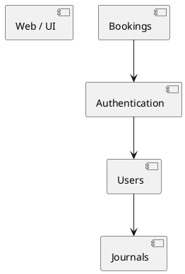

# BilCool 
A first try to create a booking application for BilCool.

Even though the domain is small the goal is to build a micro service application the communicates with gRPC, events and a React front-end running in Kubernetes.

To start with the entire application will a monloith but it will will still adhere to the the above ideas so splitting the monolith to microservices is easy.

The backend is written in Golang, the front-end is a single page React UI ( generated by Cluade since I have little knowledge in front-end development).

## Design
