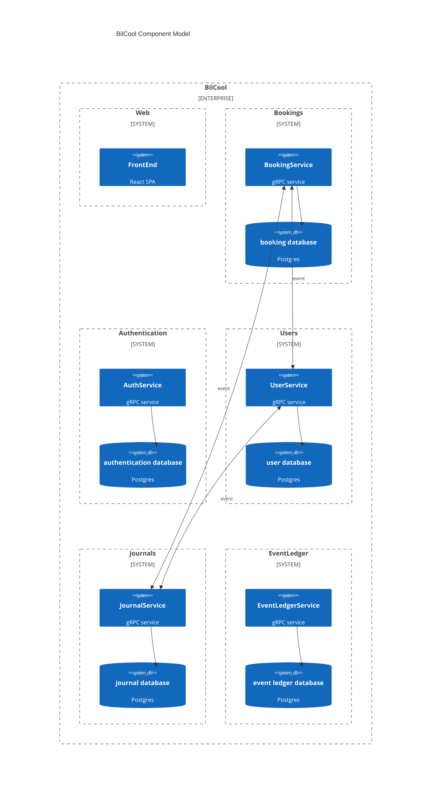

# BilCool 
A first try to create a booking application for BilCool. This is an expiriment!

Even though the domain is small the goal is to build a micro service application using events and a React front-end running in Kubernetes, Docker Swarm or uinsg AWS Lamdba.

The backend is written in Golang, the front-end is a single page React UI ( generated by Claude since I have little knowledge in front-end development [ and is not really interested in learing it either ]).

## Design

```mermaid
    C4Context
      title BilCool Component Model
        Enterprise_Boundary( BilCool, "BilCool") {
            System_Boundary(Web, "Web") {
                System(FrontEnd, "FrontEnd", "React SPA")
            }
            System_Boundary(Bookings, "Bookings") {
                System(BookingService, "BookingService", "gRPC service")
                SystemDb(BookingDb,"booking database", "Postgres")
                Rel(BookingService, BookingDb,"")
            }
            System_Boundary(Authentication, "Authentication") {
                System(AuthService, "AuthService", "gRPC service")
                SystemDb(AuthDb,"authentication database", "Postgres")
                Rel(AuthService,AuthDb,"")
            }
            System_Boundary(Users, "Users"){
                System(UserService, "UserService", "gRPC service")
                SystemDb(UserDb,"user database", "Postgres")
                Rel(UserService,UserDb,"")
            }
            System_Boundary(Journals, "Journals"){
                System(JournalService, "JournalService", "gRPC service")
                SystemDb(JournalDb,"journal database", "Postgres")
                Rel(JournalService,JournalDb,"")
            }
            System_Boundary(EventLedger, "EventLedger"){
                System(EventLedger, "EventLedgerService", "gRPC service")
                SystemDb(EventLedgerDb,"event ledger database", "Postgres")
                Rel(EventLedger,EventLedgerDb,"")
            }
            
            BiRel(BookingService,UserService,"event")
            BiRel(BookingService,JournalService,"event")
            BiRel(JournalService, UserService,"event")
        }
        
    
```
Each service has its own database, and a SQS queue for events. Each service uses SNS to publish events. The queues listen 
to the SNS topics and publish the events to the SQS queues.
