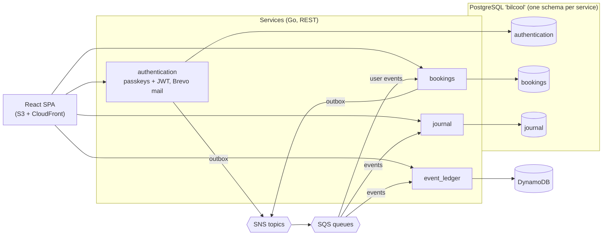

[](https://github.com/arngrimur/bilcool_monolith/actions/workflows/build.yml)

# BilCool 
A first try to create a booking application for BilCool. This is an experiment!

Even though the domain is small the goal is to build a microservice application using events and a React front-end, running in Kubernetes, Docker Swarm or using AWS Lambda.

The backend is written in Golang, the front-end is a single page React UI ( generated by Claude since I have little knowledge in front-end development [ and is not really interested in learning it either ]).

Production runs on **AWS Lambda** (Function URLs behind CloudFront, SNS/SQS, DynamoDB) with one **Frostmoln PostgreSQL** database that holds
one schema per service. The site is https://bilcool.areskiftet44.se.

## Design

```mermaid
flowchart LR
    UI["React SPA<br/>(S3 + CloudFront)"]

    subgraph Services["Services (Go, REST)"]
        Auth["authentication<br/>passkeys + JWT, Brevo mail"]
        Book["bookings"]
        Jour["journal"]
        Ledg["event_ledger"]
    end

    subgraph PG["PostgreSQL 'bilcool' (one schema per service)"]
        AuthDb[("authentication")]
        BookDb[("bookings")]
        JourDb[("journal")]
    end
    LedgDb[("DynamoDB")]

    SNS{{"SNS topics"}}
    SQS{{"SQS queues"}}

    UI --> Auth
    UI --> Book
    UI --> Jour
    UI --> Ledg
    Auth --> AuthDb
    Book --> BookDb
    Jour --> JourDb
    Ledg --> LedgDb

    Auth -- "outbox" --> SNS
    Book -- "outbox" --> SNS
    SNS --> SQS
    SQS -- "user events" --> Book
    SQS -- "events" --> Jour
    SQS -- "events" --> Ledg
```

The services talk to each other only through events. A service writes its data and an outbox row in one transaction; the outbox is relayed
to an SNS topic, and the consuming services read the events from their SQS queues (see `message_broker/`). All HTTP APIs are REST.
Locally and in Helm each Postgres service has its own database; in production they share one database with a schema (and login role) per service.

## Getting started

```bash
task vendor     # generate go.work and vendor the modules
task up         # docker compose: services, databases, LocalStack and the UI (needs FROM_EMAIL and BREVO_API_KEY exported)
task test-all   # unit and integration tests
```

The UI is on http://localhost:3000. See `CLAUDE.md` for the full command list, the repository layout, conventions and CI/CD.

## Documentation

- `CLAUDE.md` — commands, architecture, conventions, environment variables, CI/CD
- `authentication/README.md` — passkey and email-token flows, endpoints
- `message_broker/README.md` — outbox and inbox library
- `infrastructure/frostmoln/README.md` — the shared PostgreSQL database (Terraform, bootstrap)
- `infrastructure/production/terraform/README.md` — the AWS production stack
- `plan.md` — the Neon -> Frostmoln database migration (plan and progress log)
