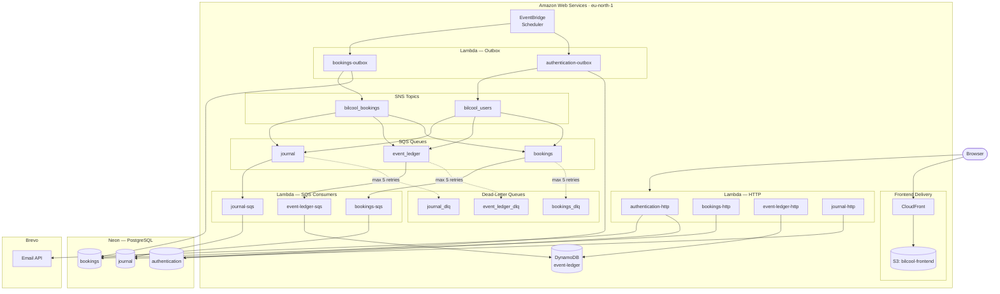

# Production Architecture

```mermaid
flowchart TB
    Browser([Browser])

    subgraph AWS["Amazon Web Services · eu-north-1"]
        subgraph cdn["Frontend Delivery"]
            direction LR
            CF["CloudFront"]
            S3_UI[("S3: bilcool-frontend")]
        end

        subgraph lambda_http["Lambda — HTTP"]
            direction LR
            L_auth_h["authentication-http"]
            L_book_h["bookings-http"]
            L_eled_h["event-ledger-http"]
            L_jr_h["journal-http"]
        end

        EB["EventBridge\nScheduler"]

        subgraph lambda_outbox["Lambda — Outbox"]
            direction LR
            L_auth_o["authentication-outbox"]
            L_book_o["bookings-outbox"]
        end

        subgraph sns["SNS Topics"]
            direction LR
            SNS_users["bilcool_users"]
            SNS_book["bilcool_bookings"]
        end

        subgraph sqs["SQS Queues"]
            direction LR
            SQS_book["bookings"]
            SQS_eled["event_ledger"]
            SQS_jr["journal"]
        end

        subgraph dlqs["Dead-Letter Queues"]
            direction LR
            DLQ_book["bookings_dlq"]
            DLQ_eled["event_ledger_dlq"]
            DLQ_jr["journal_dlq"]
        end

        subgraph lambda_sqs["Lambda — SQS Consumers"]
            direction LR
            L_book_s["bookings-sqs"]
            L_eled_s["event-ledger-sqs"]
            L_jr_s["journal-sqs"]
        end

        DynDB[("DynamoDB\nevent-ledger")]
    end

    subgraph neon["Neon — PostgreSQL"]
        direction LR
        DB_auth[("authentication")]
        DB_book[("bookings")]
        DB_jr[("journal")]
    end

    subgraph brevo["Brevo"]
        Brevo_Email["Email API"]
    end

    Browser --> CF --> S3_UI
    Browser --> lambda_http

    L_auth_h --> DB_auth
    L_book_h --> DB_book
    L_eled_h --> DynDB
    L_jr_h --> DB_jr
    L_auth_h --> Brevo_Email

    EB --> L_auth_o & L_book_o

    L_auth_o --> DB_auth
    L_auth_o --> SNS_users
    L_book_o --> DB_book
    L_book_o --> SNS_book

    SNS_users --> SQS_book & SQS_eled & SQS_jr
    SNS_book --> SQS_book & SQS_eled & SQS_jr

    SQS_book -.->|max 5 retries| DLQ_book
    SQS_eled -.->|max 5 retries| DLQ_eled
    SQS_jr -.->|max 5 retries| DLQ_jr

    SQS_book --> L_book_s
    SQS_eled --> L_eled_s
    SQS_jr --> L_jr_s

    L_book_s --> DB_book
    L_eled_s --> DynDB
    L_jr_s --> DB_jr
```
